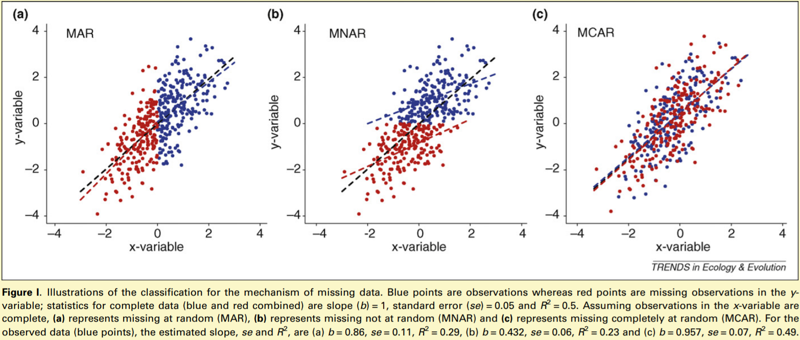
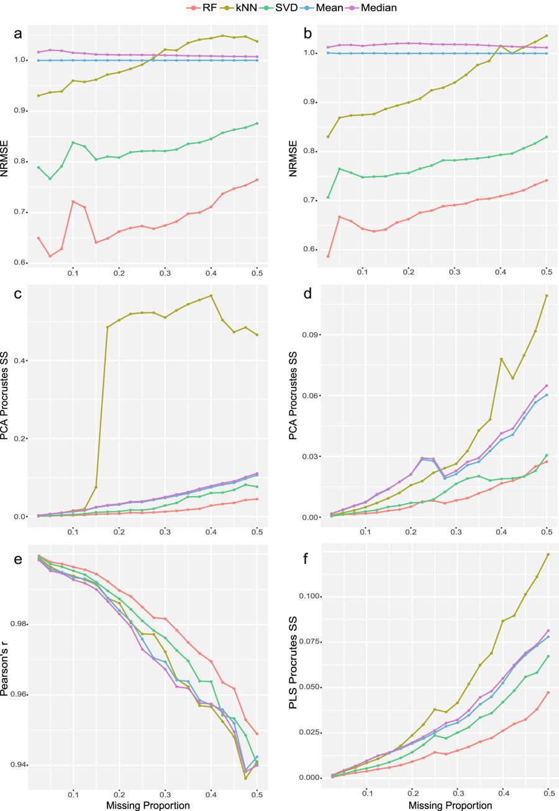
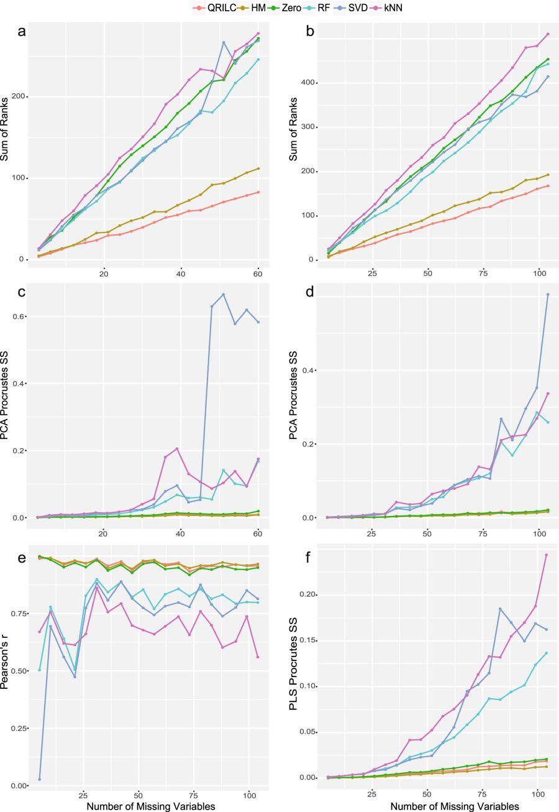

How to deal with missing value is always the first problem we need to consider when we have a set of data with missing value. Generally, there have 3 type of missing value: Missing Complete at Random (MCAR), Missing at Random (MAR) and Missing Not at Random (MNAR). The different situation has different way to handling. In this , they compare five different imputation methods (i.e., RF, kNN, SVD, Mean, Median) for MCAR/MAR and six imputation methods (i.e., QRILC, Half-minimum, Zero, RF, kNN, SVD) for MNAR. (Since MCAR and MAR are similar, they consider them as same category.) And results showed that RF imputation performed the best for MCAR/MAR and QRILC was the favored one for MNAR. So, this article will discuss 3 types of missing value and evaluate different imputation methods. 

So, next, let’s see what different of 3 types of missing value.

**Difference of MCAR, MAR, and MNAR**

* **Missing Complete at Random (MACR)**: the propensity for a data point to be missing is completely random. There’s no relationship between whether a data point is missing and any values in the data set, missing or observed. The missing data are just a random subset of the data.

* **Missing at Random (MAR)**: the propensity for a data point to be missing is not related to the missing data, but it is related to some of the observed data. For example, in a survey, poor subjects were less likely to answer a question about drug use than wealthy subjects.
To have a better understanding, we can consider MAR as Missing Conditionally at Random, because the missingness is conditional on another variable. 
Since those two types of missing value are very similar and hard to distinguish them, we will put them together to analyze. “Missing Completely at Random” and “Missing at Random” are both considered ‘ignorable’ because we don’t have to include any information about the missing data itself when we deal with the missing data.

* **Missing Not at Random (MNAR)**: there is a relationship between the propensity of a value to be missing and its values. MNAR is called “non-ignorable” because the missing data mechanism itself has to be modeled as you deal with the missing data. You have to include some model for why the data are missing and what the likely values are. 


```{r, layout="l-body-outset", preview=TRUE, fig.cap="Figure from https://www.sciencedirect.com/science/article/pii/S0169534708002772#fig1", out.extra="class=external"}

```


**Evaluation of imputation**

* **Evaluation of different imputation methods for MCAR/MAR:** The paper generated random missing value on two data set from the proportion of 2.5% to 50% in step of 2.5%. And then use PCA to evaluate performance for the both data set. The result showed that RF (Imputation with Random Forest) performed the best in the all imputation methods. 


```{r fig.cap="Figure from https://www.nature.com/articles/s41598-017-19120-0/figures/1#search-menu", out.extra="class=external" ,preview=TRUE}

```
*Fig.2 Evaluation of different imputation methods for MCAR/MAR (a,b) NRMSE on unlabeled and labeled metabolomics data. (c,d) PCA-Procrustes sum of squared errors on unlabeled and labeled metabolomics data. (e) Pearson correlation of log p-values (t-test) of complete data and imputed data. (f) PLS-Procrustes sum of squared errors.*


* **Evaluation of different imputation methods for MNAR:** There have six imputation methods applied to same data set with previous one. And three of imputation methods (RF, kNN, SVD) are same the MCAR/MAR, and other three are left-censored imputation methods (QRILC, HM, Zero) on MNAR. After imputation, NMRSE-based SOR as a nonparametric method to evaluate the accuracy. The result showed that QRILC performed the best, followed by HM imputation. However, the imputation methods (RF, Knn, SVD) which used in MCAR/MAR performed poorly in MNAR. 

```{r fig.cap="Figure from https://www.nature.com/articles/s41598-017-19120-0/figures/1#search-menu", out.extra="class=external"}

```
*Fig. 3 Evaluation of different imputation methods for MNAR (a,b) SOR on unlabeled and labeled metabolomics data. (c,d) PCA-Procrustes sum of squared errors on unlabeled and labeled metabolomics data. (e) Pearson correlation of log p-values (t-test) of missing variables from complete data and imputed data. (f) PLS-Procrustes sum of squared errors.*


**What is QRILC (Quantile Regression Imputation of Left-Censored data):**

QRILC imputation was specifically designed for left-censored data, data missing caused by lower than LOQ. This method imputes missing elements with randomly drawing from a truncated distribution estimated by a quantile regression. A beforehand log-transformation was conducted to improve the imputation accuracy. R package imputeLCMD was applied for this imputation approach.


**Since metabolomics usually suffer from MNAR, QRILC imputation method is best for it.**


